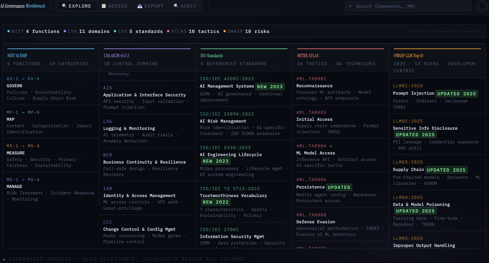
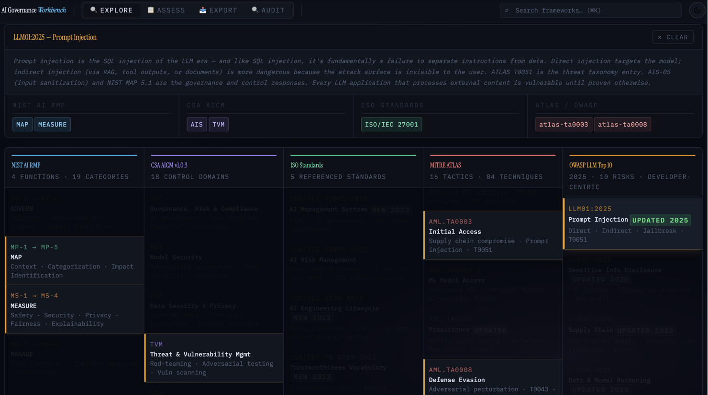

# AI Governance Practitioner Workbench

A browser-based portfolio project for exploring AI governance frameworks, reviewing control coverage, and running structured AI risk assessments.

I built this static web application to make complex governance material easier to work with in one place. It combines cross-framework mapping, lightweight control tracking, session management, and exportable risk review outputs in a zero-dependency interface built with HTML, CSS, and JavaScript.


## Screenshots

*Overview of the six-framework Explore interface.*


*Selected item view showing cross-framework relationships and linked governance context.*


## Overview

The workbench brings together six AI governance frameworks in a single browser-based interface:

| Framework | Coverage |
|---|---|
| NIST AI RMF 1.0 | GOVERN · MAP · MEASURE · MANAGE |
| EU AI Act (Reg. 2024/1689) | Prohibited practices, HRAI requirements, obligations, post-market, transparency, enforcement |
| ISO/IEC 42001:2023 | AI Management System |
| ISO/IEC 27001 | Information Security Management |
| CSA AI Controls Matrix (AICM) | 11 control domains |
| MITRE ATLAS | 10 adversarial ML tactic categories |
| OWASP LLM Top 10 2025 | 10 LLM risk categories |

It supports five core workflows:

- **Explore** — map relationships across all six framework columns
- **Assess** — track implementation status for each control
- **Export** — generate markdown control inventories and gap reports
- **Audit** — run a structured five-step AI risk assessment with Word (.docx) export
- **Session** — save, resume, and export assessment state as JSON

## Why This Project

AI governance work is often fragmented across standards, controls, and risk guidance. This project creates a lightweight tool that helps users compare framework concepts, track control status, and run a structured risk review in one place — no server, no dependencies, no install.

## Getting Started

Clone the repository:

```bash
git clone https://github.com/Joieux/ai-governance-workbench.git
cd ai-governance-workbench
```

Open the main file in your browser:

```bash
# macOS
open index.html

# Windows
start index.html

# Linux
xdg-open index.html
```

## Repository Structure

```text
ai-governance-workbench/
├── index.html        # Application shell and all framework DOM items
├── data.js           # Static data layer: DOC_LIBRARY, RISK_SCENARIOS, mappings
├── script.js         # Runtime logic: rendering, assess, audit, export, session
├── styles.css        # All styles including @media print for PDF output
├── README.md
├── USER_GUIDE.md
├── docs/
│   ├── screenshot-overview.png
│   └── screenshot-in-action.png
└── LICENSE
```

## Key Features

- **Zero dependencies** — plain HTML/CSS/JS, opens directly in any modern browser
- **Cross-framework wiring** — clicking any item highlights its counterparts across all six columns
- **Assess mode** — mark controls Done / In Progress / Not Started with localStorage persistence
- **Audit mode** — five-step structured risk assessment (System Profile → Scenarios → Risk Register → Findings → Report)
- **Word export** — download the audit report as a formatted .docx file with cover page, risk tables, and gap summary
- **Session management** — save and restore full assessment state; export/import as JSON; reset to start fresh
- **Print/PDF** — Ctrl/Cmd+P from the Audit Report tab produces a clean A4-formatted output
- **EU AI Act integration** — seven compliance areas wired bidirectionally to NIST, CSA, and ISO

## Documentation

For full usage instructions, workflow details, framework reference material, and glossary terms, see the [User Guide](./USER_GUIDE.md).

## License

This project is licensed under the MIT License. See [LICENSE](LICENSE) for details.
